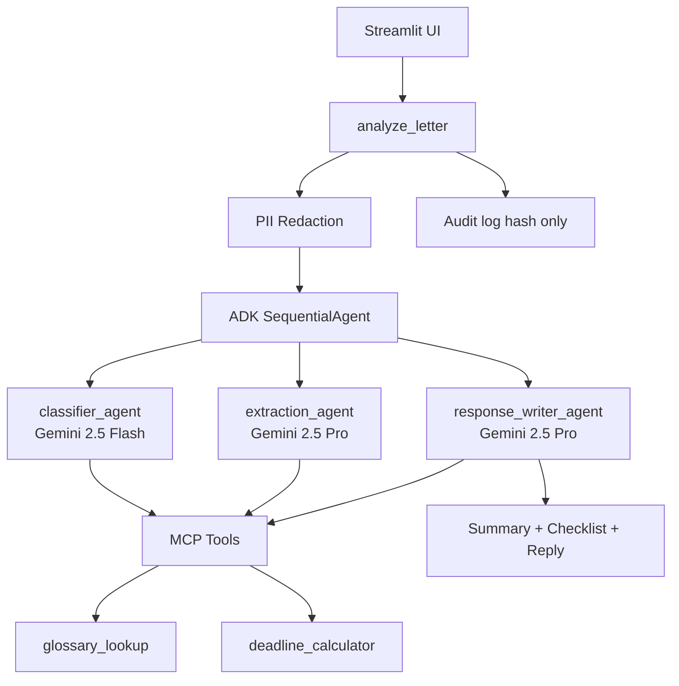

# German Bureaucracy AI Agent

**Kaggle Capstone - Concierge Agents - Google ADK + Gemini 2.5 + MCP**

A multi-agent concierge that helps immigrants in Germany understand official letters from Jobcenter, Finanzamt, Auslaenderbehoerde, and Krankenkasse.

> **Not legal advice.** AI-generated summaries only. See [DISCLAIMER.md](DISCLAIMER.md).

---

## Streamlit UI (single-page MVP)

The demo runs as **one Streamlit page** (`apps/streamlit_app/app.py`). It calls `agents.analyze_letter()` directly — no API gateway or API token required. Only `GOOGLE_API_KEY` in `.env` is needed.

Legacy multipage routes (`pages/`) have been removed for the Kaggle MVP.

---

## For judges (60-second overview)

| Requirement | How this project demonstrates it |
|-------------|----------------------------------|
| Google ADK multi-agent | `SequentialAgent` orchestrator with 3 `LlmAgent` specialists |
| Gemini | Flash (classifier) + Pro (extraction, response writer) |
| MCP | `glossary_lookup` + `deadline_calculator` in `mcp_servers/bureaucracy_mcp/` |
| Security | PII redaction before LLM; audit log stores hash only; legal disclaimer |
| Deployable | `pip install` + `streamlit run` on Windows, macOS, Linux |

**Demo flow:** Load sample Jobcenter letter -> Analyze -> institution, deadlines, checklist, German reply draft.

---

## Architecture



---

## Demo mode (Kaggle recording)

Gemini free tier allows only a few requests per minute. For reliable screen recording:

```env
DEMO_MODE=true
```

This skips live Gemini/ADK calls and returns a static analysis of the sample Jobcenter letter. The real pipeline in `agents/pipeline.py` is unchanged — set `DEMO_MODE=false` to use it.

If a live run hits **429 RESOURCE_EXHAUSTED**, the app shows a friendly quota message and (by default) the same static fallback when `DEMO_FALLBACK_ON_QUOTA=true`.

---

## Quick start (Windows)

```powershell
cd kaggle-project
python -m venv .venv
.\.venv\Scripts\Activate.ps1
pip install -r requirements.txt
copy .env.example .env
# Edit .env: set GOOGLE_API_KEY=your-key
python -m streamlit run apps\streamlit_app\app.py
```

Open http://localhost:8501 -> sidebar **Load sample Jobcenter letter** -> **Analyze letter**.

**Shortcut:** `.\scripts\run_mvp.ps1`

---

## Quick start (macOS / Linux)

```bash
cd kaggle-project
python3 -m venv .venv
source .venv/bin/activate
pip install -r requirements.txt
cp .env.example .env
# Edit .env: set GOOGLE_API_KEY=your-key
streamlit run apps/streamlit_app/app.py
```

---

## Screenshots

Add before submission:

| # | File | What to show |
|---|------|--------------|
| 1 | `docs/screenshots/01_home.png` | Home screen with sample letter loaded |
| 2 | `docs/screenshots/02_results.png` | Institution, summary, deadlines |
| 3 | `docs/screenshots/03_checklist.png` | Action checklist and German reply |
| 4 | `docs/screenshots/04_technical.png` | Technical details expander (ADK + MCP) |

---

## Tests

```powershell
python -m pytest tests\unit\ -v
```

---

## MCP server (optional)

```powershell
python -m mcp_servers.bureaucracy_mcp.server
```

---

## Kaggle submission

| Document | Purpose |
|----------|---------|
| [docs/kaggle_writeup.md](docs/kaggle_writeup.md) | Paste into Kaggle writeup |
| [docs/video_demo_script.md](docs/video_demo_script.md) | 5-minute video script |
| [docs/judging_checklist.md](docs/judging_checklist.md) | Pre-submit verification |

---

## Project structure (MVP)

```
agents/                      ADK orchestrator + 3 agents + pipeline
apps/streamlit_app/app.py   Single-page demo UI (no API gateway)
mcp_servers/bureaucracy_mcp/ MCP tools
knowledge/glossary/          Curated terms
tests/fixtures/              Sample Jobcenter letter
```

---

## Security

- Only `GOOGLE_API_KEY` required (via `.env`, never committed)
- PII redacted before Gemini calls (`agents/security.py`)
- Audit log: institution + letter type + SHA-256 hash only

---

## License

Apache 2.0 - see [LICENSE](LICENSE)
