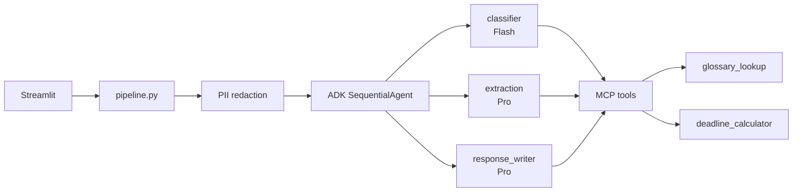

# Kaggle Writeup

**Competition:** AI Agents Intensive — Vibe Coding Capstone  
**Category:** Concierge Agents  
**Title:** German Bureaucracy AI Agent — A Concierge for Official Letters

---

## Elevator pitch

Official letters in Germany are written in formal bureaucratic German, often with legal deadlines buried in dense paragraphs. For immigrants, missing a single **Frist** can mean suspended benefits, fines, or residence problems. This project is a **concierge agent** that reads the letter, explains it in plain English, lists what to do next, and drafts a polite German reply — built with **Google ADK**, **Gemini 2.5**, and **MCP**, with **PII redaction** and clear legal disclaimers.

---

## The problem

Germany is home to millions of people with a migration background. They regularly receive letters from:

- **Jobcenter** (benefits, document requests)
- **Finanzamt** (tax decisions, payment deadlines)
- **Ausländerbehörde** (residence permits, appointments)
- **Krankenkasse** (health insurance notices)

These letters use *Amtsdeutsch* — formal language with legal references (SGB II, AufenthG, etc.). Professional help exists but costs money and takes time. A missed deadline on a **Nachforderung** (document request) can pause benefit payments within weeks.

**Example:** Maria receives a Jobcenter letter demanding Meldebescheinigung and bank statements by 15 July. She does not know what happens if she is late. This agent answers that in minutes.

---

## The solution

A Streamlit app where the user pastes or uploads a letter. Behind the scenes:

1. **PII redaction** — names, addresses, case numbers removed before any LLM call
2. **Classifier agent** (Gemini 2.5 Flash) — detects institution and letter type
3. **Extraction agent** (Gemini 2.5 Pro) — pulls deadlines, documents, amounts, actions
4. **Response writer agent** (Gemini 2.5 Pro) — English summary, prioritized checklist, German reply draft
5. **Disclaimer + safe logging** — hash-only audit trail, no letter content stored

The user gets a clear action plan, not a wall of German legalese.

---

## Why multi-agent (not one prompt)?

| Design choice | Benefit |
|---------------|---------|
| Separate classifier / extractor / writer | Facts separated from interpretation — reduces hallucinated deadlines |
| Gemini Flash for classification | Fast, low-cost routing |
| Gemini Pro for extraction + writing | Higher quality on structured JSON and long-form text |
| ADK `SequentialAgent` | Deterministic pipeline judges can trace in code |
| MCP tools | Grounded glossary and deadline math — not model memory |

This is a real **Google ADK** multi-agent system, not a single chat prompt with labels.

---

## Technical architecture



**MCP server:** `mcp_servers/bureaucracy_mcp/` exposes two tools agents call during analysis:

- `glossary_lookup` — curated DE→EN definitions (Bescheid, Nachforderung, Frist)
- `deadline_calculator` — parses DD.MM.YYYY dates and computes urgency

Run standalone: `python -m mcp_servers.bureaucracy_mcp.server`

---

## Security and responsible AI

Sensitive domains require careful design:

- **PII redaction** before Gemini processing
- **No letter content in logs** — only institution, letter type, and SHA-256 hash
- **Legal disclaimer** on every result — explicitly not legal advice
- **Honest limitations** stated in UI and documentation

---

## Demo

**Windows (tested):**

```powershell
python -m venv .venv
.\.venv\Scripts\Activate.ps1
pip install -r requirements.txt
copy .env.example .env
# Set GOOGLE_API_KEY in .env
python -m streamlit run apps\streamlit_app\app.py
```

**Sample input:** `tests/fixtures/sample_letters/jobcenter_nachforderung.txt`  
**Expected output:** Jobcenter · Nachforderung · deadline 15.07.2025 · document checklist · English summary · German reply

**Live demo URL:** _[add Streamlit Cloud link]_  
**Video:** _[add 5-min demo link]_  
**GitHub:** _[add repo URL]_

---

## What makes this a strong Concierge Agent

- **End-to-end workflow** — paste letter → structured guidance → reply draft
- **Bilingual bridge** — German letter in, English explanation out, German reply back
- **Action-oriented** — checklist with urgency, not just a summary
- **Judge-visible tech** — ADK agents, MCP tools, model routing all demonstrable in UI and code

---

## Limitations (honest)

- Not a substitute for a lawyer, tax advisor, or migration counselor
- Rules vary by **Bundesland** and local authority
- Scanned PDFs without OCR may fail (text-based PDFs work)
- German reply draft must be reviewed before sending

---

## What I learned

- ADK `SequentialAgent` is an effective pattern for deterministic multi-step pipelines
- MCP tools keep agents grounded in curated data instead of hallucinating definitions
- For hackathons, **demo reliability** beats architectural breadth — focused MVP wins

---

## Keywords

`google-adk` `gemini-2.5` `mcp` `multi-agent` `streamlit` `concierge-agent` `germany` `immigration`
